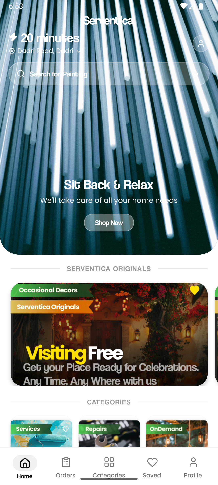

# SERVENTICA — Master Monorepo

Production-grade quick-commerce home services & on-demand workforce marketplace platform.



## Overview & Current State

### Customer App Home UI/UX Architecture
- **Adaptive Full-Width Top Hero**:
  - Immersive category-aware gradient backgrounds with curved bottom boundary (`borderBottomRadius: 36`).
  - Dynamic Hero asset matching selected category (AC & Appliances, Cleaning, Electrical, Plumbing, Painting).
- **Quick-Commerce Delivery Header**:
  - **Electric Delivery Timestamp**: Pure white electric bolt icon (`Zap`) with ETA calculation (`formattedETA`).
  - **Live Geolocation Fetching**: Automatically detects real device latitude/longitude with Android permissions, reverse-geocodes to neighborhood/city, and supports an interactive manual address picker modal.
  - **Profile & Quick Actions**: Compact account button and translucent frosted-glass search bar directly under the header.
- **Trigger-Driven Smooth Sticky Navigation Header**:
  - When scrolling past the hero section (`220px`), an `Animated.spring` physics driver slides the compact navigation header down smoothly and fully into place.
  - Returns smoothly off-screen with `Animated.timing` when scrolling back to the top.
  - Inherits the active category color theme and radial/linear SVG gradients with monochromatic category rail.
- **Modern Typography & Design System**:
  - **Coolvetica + SF Pro / Poppins Pairing**: Distinctive Coolvetica for major headlines, cards, and branding titles; legible medium/regular fonts for descriptions and sub-labels.
- **Refined Bottom Navigation Bar**:
  - Elevated floating rounded panel (`borderRadius: 28`) in clean `#FFFFFF` with active tab indicators and smooth transitions.
- **Dynamic Promo & Service Showcase**:
  - Rotating promotional banners and seasonal campaigns.
  - Category-driven service cards with transparent pricing, ratings, and time estimates.
- **Interactive Home Catalog**:
  - **Serventica Originals**: Featured seasonal offerings with discount badges.
  - **3 Core Pillars**: Services, Repairs, and OnDemand cards.
  - **Basics Grid**: Quick-access essential services (AC Repair, Electrician, Plumbing, RO Filter, Inverter, Cleaning, Washing Machine).
  - **Integrated Real-Time Search**: Instant indexed search overlay matching services and categories across the entire catalog.

---

## Monorepo Applications
- `apps/customer`: React Native Customer Mobile App (Android & iOS)
- `apps/partner`: React Native Partner Mobile App (Android & iOS)
- `apps/admin`: Next.js Operations & Catalog Portal
- `apps/api`: NestJS Core Platform API & Dispatch Engine

## Shared Packages
- `packages/types`: Canonical TypeScript domain contracts
- `packages/validation`: Zod request schemas
- `packages/design-system`: Light Theme tokens, Coolvetica & Poppins typography
- `packages/api-client`: Standardized REST/Realtime client
- `packages/analytics`: Event taxonomy & analytics schema
- `packages/config`: Environment configuration contracts
- `packages/utils`: Currency, math & date formatters

---

## Development & Running Locally

### Prerequisites
- Node.js 18+
- React Native CLI & Android SDK (API 34+)
- Android Emulator or connected physical device via ADB

### Starting the Metro Bundler
```bash
npm start
```

### Running on Android
```bash
npm run android
```

> **Fast Refresh Rule**: Keep Metro running during UI work. Native rebuilds (`gradlew clean`) are not needed for React / styling updates.

---

## Database Migrations
Supabase migrations are managed under `supabase/migrations/`:
- `20260908000001_serventica_foundation.sql`: Core schema, auth, bookings, service catalog.
- `20260908000002_home_catalog_and_search.sql`: Real search indexing, home feed categories, banners, and basics.
