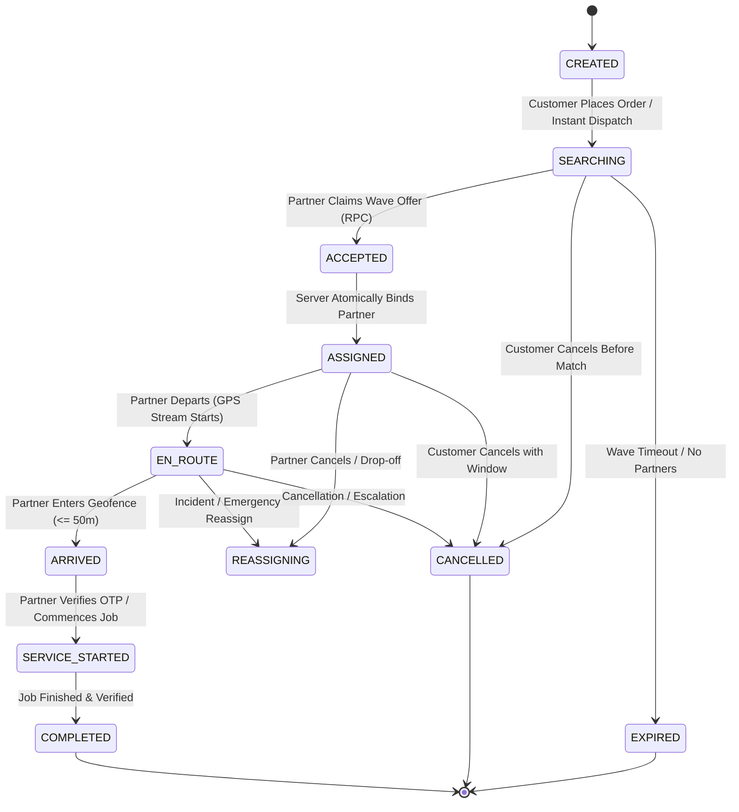
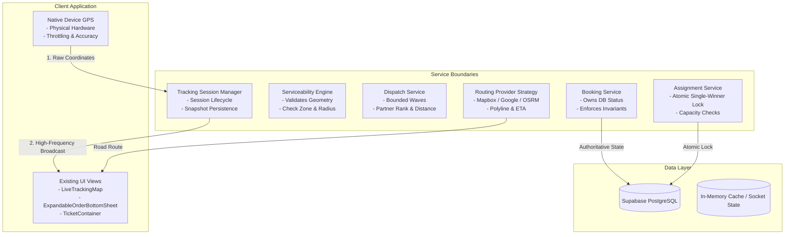
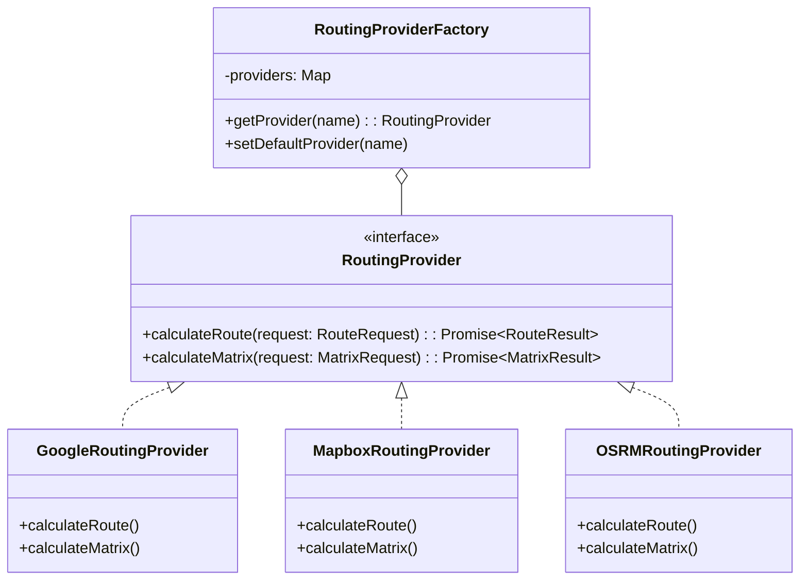

# SERVENTICA LIVE TRACKING ARCHITECTURE — PHASE 1 SPECIFICATION
**Authoritative Tracking Foundation, Audit, State Model, Security & Multi-Provider Architecture**
*Status: Architecture Approved & Foundation Verified*

---

## 1. Executive Summary & Purpose

Serventica is a high-reliability on-demand home services platform with instant (15-45 minute dispatch) and scheduled fulfillment modes.

This document establishes the **authoritative architecture, data ownership, state machines, security boundaries, room protocols, and provider abstractions** required for the end-to-end real-time tracking ecosystem without modifying existing UI/UX or creating duplicate models.

---

## 2. Complete Architecture Audit Report

Each component in the relevant ecosystem is classified under the Phase 1 schema:
`[CORRECT]`, `[PARTIAL]`, `[INCORRECT]`, `[DUPLICATE]`, `[MISSING]`

| Area / Component | Classification | File / Implementation | Current Behavior & Evaluation | Phase 1 Action & Strategy | Risk & Dependencies |
| :--- | :--- | :--- | :--- | :--- | :--- |
| **Booking State Model** | `[PARTIAL]` | [`packages/types/src/index.ts`](file:///c:/dev/serventica-app/packages/types/src/index.ts#L63-L84) | 20+ fine-grained enum values. PostgreSQL RPC enforces step transitions. Lacks formal client/server tracking sync guard table. | Establish single canonical lifecycle mapping table. Add transition validator. | Low risk. Backward compatible. |
| **Atomic Dispatch Engine** | `[CORRECT]` | [`supabase/migrations/20260915000001_serventica_fulfillment_dispatch_engine.sql`](file:///c:/dev/serventica-app/supabase/migrations/20260915000001_serventica_fulfillment_dispatch_engine.sql#L349-L449) | `accept_dispatch_offer` uses PostgreSQL `FOR UPDATE` row-level locks, guarantees single-winner atomic assignment. | Retain completely as authoritative partner assignment backend. | Zero risk. Reused directly. |
| **Job Lifecycle Transitions** | `[CORRECT]` | [`supabase/migrations/20260915000001_serventica_fulfillment_dispatch_engine.sql`](file:///c:/dev/serventica-app/supabase/migrations/20260915000001_serventica_fulfillment_dispatch_engine.sql#L481-L540) | RPC `transition_partner_job_status` validates caller identity (`partner_id = assigned_partner_id`) and status progression. | Authoritative source of truth for durable business transitions. | Zero risk. |
| **Tracking Transport** | `[PARTIAL]` | [`apps/customer/src/services/LiveTrackingService.ts`](file:///c:/dev/serventica-app/apps/customer/src/services/LiveTrackingService.ts) | Uses Supabase Realtime channel `order_${bookingId}_tracking`. Works for prototypes; lacks Socket.IO room token auth and heartbeat lease. | Formalize room contracts and payload specs. Isolate transport interface so Socket.IO plugs in seamlessly in Phase 3. | Medium. Avoid high DB write rate. |
| **Tracking Session Schema** | `[MISSING]` | PostgreSQL schema | Uses `partner_presence_sessions` and `partner_locations` table for audit log, but no explicit `tracking_sessions` lifecycle row per booking. | Define `tracking_sessions` schema with connection status, lease expiration, and snapshot persistence. | Low risk. Clean non-breaking migration. |
| **Routing Strategy Factory** | `[CORRECT]` | [`apps/customer/src/services/routing/RoutingProviderFactory.ts`](file:///c:/dev/serventica-app/apps/customer/src/services/routing/RoutingProviderFactory.ts) | Decoupled strategy pattern supporting Google, Mapbox, and OSRM. Reusable across client and server. | Retain. Export provider contract into canonical types package. | Zero risk. |
| **Native GPS Provider** | `[CORRECT]` | [`apps/customer/src/services/location.service.ts`](file:///c:/dev/serventica-app/apps/customer/src/services/location.service.ts#L436-L540) | Uses Expo Location + native Android Kotlin module fallback with accuracy bounds and reverse geocoding. | Reused for physical device GPS source without depending on Mapbox/Google billing. | Zero risk. |
| **Embedded Map UI** | `[CORRECT]` | [`apps/customer/src/features/account/components/LiveTrackingMap.tsx`](file:///c:/dev/serventica-app/apps/customer/src/features/account/components/LiveTrackingMap.tsx) | Clean backdrop integration with fallback vector polylines, animated radar, and expand sheet. | Preserved without visual alterations. Will consume standardized tracking contracts. | Zero risk. |
| **Partner App Simulator** | `[CORRECT]` | [`apps/customer/src/features/account/screens/PartnerAppSimulatorScreen.tsx`](file:///c:/dev/serventica-app/apps/customer/src/features/account/screens/PartnerAppSimulatorScreen.tsx) | Controlled testing screen for partner accept, en route, GPS movement. Clearly isolated under Account > Developer tools. | Preserved as isolated developer test bench. | Zero production risk. |

---

## 3. Canonical Booking & Tracking Lifecycle

The canonical state machine unifies existing Supabase enum values and client UI states.



### State Mapping Matrix

| Conceptual State | Database Status (`bookings.status`) | Tracking Status | UI Backdrop State | Partner Can Transition? | Customer Can Cancel? |
| :--- | :--- | :--- | :--- | :--- | :--- |
| **CREATED** | `DRAFT` / `CONFIRMED` | `NOT_AVAILABLE` | Radar Searching | No | Yes (Full refund) |
| **SEARCHING** | `SEARCHING_PARTNER` | `SEARCHING_PARTNER` | Radar Searching Backdrop | No | Yes (Full refund) |
| **ACCEPTED** | `PARTNER_ACCEPTED` | `PARTNER_ASSIGNED` | Servs Found Backdrop | Yes (accept RPC) | Yes (Full refund) |
| **ASSIGNED** | `PARTNER_ASSIGNED` | `WAITING_FOR_FIRST_LOCATION` | Servs Found / Map Ready | Yes (start route) | Yes (Policy applied) |
| **EN_ROUTE** | `PARTNER_EN_ROUTE` | `LIVE` | LiveTrackingMap (Route + Car) | Yes (mark arrived) | Yes (With penalty) |
| **ARRIVED** | `PARTNER_ARRIVED` | `ARRIVED` | LiveTrackingMap (Arrived Pin) | Yes (start service) | Restricted |
| **SERVICE_STARTED**| `SERVICE_STARTED` | `SERVICE_STARTED` | In-Service Status Card | Yes (complete) | No (Dispute only) |
| **COMPLETED** | `SERVICE_COMPLETED` / `CLOSED` | `SERVICE_COMPLETED` | Service Completed Backdrop | Yes | No |
| **CANCELLED** | `CANCELLED_BY_*` | `CANCELLED` | Order Cancelled Backdrop | No | No |

---

## 4. Separation of Responsibilities



---

## 5. Location Model & Data Structures

### Fixed Customer Service Location vs. Dynamic Partner Location

```typescript
// 1. Fixed Service Location (Customer Destination)
export interface ServiceLocation {
  latitude: number;
  longitude: number;
  addressId: string;
  formattedAddress: string;
  shortAddress: string;
  landmark?: string | null;
  city: string;
  state: string;
  pincode: string;
  placeId?: string; // Google / Mapbox reference
}

// 2. Dynamic Partner Location (Physical Device Movement)
export interface PartnerLocationUpdate {
  bookingId: string;
  partnerId: string;
  latitude: number;
  longitude: number;
  accuracy: number;        // in meters (reject > 100m in production)
  heading: number;         // 0 - 360 degrees
  speed: number;           // m/s
  altitude?: number;
  timestamp: string;       // ISO 8601 UTC
  isMocked?: boolean;      // flag fake locations
}
```

---

## 6. Tracking Session & Database Write Strategy

### Why Raw High-Frequency GPS Updates Never Direct-Write to Postgres
- GPS updates occur every 1–2 seconds per active moving partner.
- 100 active jobs = 50–100 writes/sec to PostgreSQL disk, triggering WAL bloat, indexing lag, and battery/network strain.
- **Rule**: High-frequency streaming belongs in **Socket.IO / Realtime transport**.
- PostgreSQL only stores:
  1. Session state changes (`WAITING_FOR_LOCATION`, `LIVE`, `ARRIVED`, `STOPPED`).
  2. Debounced last-known location (once every 15–30 seconds for recovery).
  3. Milestone audit records (`DISPATCHED`, `EN_ROUTE`, `ARRIVED`, `STARTED`, `COMPLETED`).

### Proposed Tracking Session Table Schema (Supabase)
```sql
CREATE TABLE IF NOT EXISTS public.tracking_sessions (
  id UUID PRIMARY KEY DEFAULT gen_random_uuid(),
  booking_id UUID NOT NULL REFERENCES public.bookings(id) ON DELETE CASCADE,
  partner_id UUID NOT NULL REFERENCES public.professionals(id) ON DELETE CASCADE,
  customer_id UUID NOT NULL REFERENCES public.users(id) ON DELETE CASCADE,
  status TEXT NOT NULL DEFAULT 'NOT_STARTED' CHECK (
    status IN ('NOT_STARTED', 'WAITING_FOR_LOCATION', 'LIVE', 'STALE', 'ARRIVED', 'COMPLETED', 'CLOSED')
  ),
  last_latitude NUMERIC(10, 7),
  last_longitude NUMERIC(10, 7),
  last_heading NUMERIC(5, 2),
  last_speed NUMERIC(6, 2),
  last_accuracy NUMERIC(6, 2),
  last_location_at TIMESTAMPTZ,
  started_at TIMESTAMPTZ,
  ended_at TIMESTAMPTZ,
  created_at TIMESTAMPTZ NOT NULL DEFAULT NOW(),
  updated_at TIMESTAMPTZ NOT NULL DEFAULT NOW(),
  CONSTRAINT uq_tracking_session_booking UNIQUE (booking_id)
);

CREATE INDEX IF NOT EXISTS idx_tracking_sessions_partner ON public.tracking_sessions(partner_id, status);
CREATE INDEX IF NOT EXISTS idx_tracking_sessions_booking ON public.tracking_sessions(booking_id);
```

---

## 7. Socket.IO Room Architecture & Security Boundaries

### Room Naming Pattern
`tracking:{bookingId}`

### Cryptographic Room Authorization
A client cannot enter a tracking room simply by passing a `bookingId`. The server validates an ephemeral HMAC token or validates JWT session against the database:

1. **Customer Connection**:
   - `auth.userId == booking.customerId`
   - Role = `CUSTOMER`
   - Access = Read-only listener (subscribes to `tracking:location`, `tracking:status`, `tracking:eta`).
2. **Partner Connection**:
   - `auth.partnerId == booking.partnerId`
   - Role = `PARTNER`
   - Access = Publisher + Listener (publishes `partner:location`, receives customer cancellation notices).
3. **Eavesdropping Prevention**:
   - All events emitted with `io.to('tracking:' + bookingId)`.
   - Any join attempt without valid session ownership returns `403 Forbidden` / `tracking:error`.

---

## 8. Socket Event Contracts (Phase 3 Interface)

| Event Name | Direction | Sender | Payload | Description |
| :--- | :--- | :--- | :--- | :--- |
| `tracking:join` | Client $\to$ Server | Customer / Partner | `{ bookingId: string, token: string }` | Authoritative room join handshake. |
| `tracking:snapshot` | Server $\to$ Client | Server | `TrackingSnapshotPayload` | Complete state delivered upon initial join or reconnect. |
| `partner:location` | Client $\to$ Server | Partner App | `PartnerLocationUpdate` | Raw physical GPS reading from device. |
| `tracking:location`| Server $\to$ Client | Server | `SanitizedPartnerLocation` | Cleaned, validated coordinate broadcast to Customer. |
| `tracking:status`  | Server $\to$ Client | Server | `{ bookingId, status, timestamp }` | Operational status updates (`EN_ROUTE`, `ARRIVED`, etc.). |
| `tracking:eta`     | Server $\to$ Client | Server | `{ durationMinutes, distanceKm, polyline }` | Debounced road route & ETA updates. |
| `tracking:arrival` | Server $\to$ Client | Server | `{ bookingId, arrivedAt }` | Geofence arrival broadcast. |
| `tracking:error`   | Server $\to$ Client | Server | `{ code: string, message: string }` | Security or validation rejection. |

---

## 9. Location Validation & Anti-Spoofing Rules

Before any partner coordinate is relayed or stored, the server validates:
1. **Coordinate Geofence Bounds**:
   - Latitude: $-90.0 \le \text{lat} \le 90.0$
   - Longitude: $-180.0 \le \text{lon} \le 180.0$
2. **Freshness Window**:
   - $|\text{now} - \text{timestamp}| \le 15\text{ seconds}$. Old GPS logs rejected.
3. **Accuracy Filter**:
   - `accuracy <= 100 meters` accepted for live navigation.
   - `accuracy > 100 meters` marked coarse / discarded from road snapping.
4. **Speed & Teleportation Guard**:
   - Maximum reasonable motorcycle/car velocity in city: $120\text{ km/h}$ ($\approx 33.3\text{ m/s}$).
   - If computed speed between consecutive updates exceeds threshold: reject as impossible GPS jump.
5. **Assignment Ownership**:
   - Partner ID in update MUST match the assigned partner ID on the booking session.

---

## 10. Map & Routing Abstraction (Mapbox Primary, Google Maps Future)

The app architecture decouples map rendering and route engines using the Provider Pattern:



- **Mapbox**: Embedded client visual map + directions route polyline.
- **Google Maps**: External navigation handoff intent (`geo:lat,lng` / Apple Maps URI) + geocoding.
- Switching routing providers in production requires zero modifications to booking or tracking components.

---

## 11. Snapshot + Realtime Reconnection Strategy

```
1. Customer Opens Screen / Reconnects
   └── Fetch HTTP / RPC Snapshot: GET /api/tracking/{bookingId}/snapshot
       ├── Booking Status
       ├── Assigned Partner Profile
       ├── Customer Fixed Coordinates
       ├── Partner Last Known Coordinates
       └── Cached Road Polyline + ETA
2. Connect to Realtime Transport
   └── Join Room: tracking:{bookingId}
3. Stream Updates
   └── Merge incoming delta events into isolated React Ref / Animated Coordinates
4. Network Loss / Backgrounding
   └── Buffer UI State -> On foreground: refresh snapshot & resume stream
```

---

## 12. UI/UX Preservation & Smooth Movement Strategy

The visual aesthetics and screen layouts are strictly preserved:
- [`BookingDetailScreen.tsx`](file:///c:/dev/serventica-app/apps/customer/src/features/account/screens/BookingDetailScreen.tsx) remains the product UI.
- Top backdrop smoothly alternates between:
  1. Radar Searching (State 1)
  2. Servs Found Animation (State 2)
  3. Live Route Map (State 3 - En Route / Arrived)
  4. Service Completed (State 4)
  5. Order Cancelled (State 5)
- **High-Frequency Performance Rule**: GPS updates must update the animated coordinate directly (`Animated.ValueXY` / `react-native-reanimated` shared value) rather than re-rendering the parent component with full React state passes. Route geometry recalculates only when the partner moves $> 150\text{ meters}$ off-route.

---

## 13. Phase 2 Handoff & Implementation Scope

With Phase 1 contracts formalized:
- **Phase 2 Implementation Scope**:
  1. Mapbox native / vector integration in `LiveTrackingMap.tsx`.
  2. Native GPS watcher hook for Partner app simulator / partner client.
  3. Road snap coordinate interpolator.
  4. Real-time ETA debouncer.
- All Phase 2 work will link directly into these verified contracts without altering UI layout, typography, or existing booking persistence.
