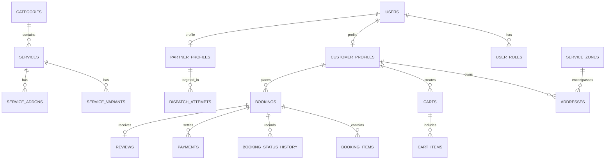

# SERVENTICA — Comprehensive PostgreSQL & PostGIS Schema Architecture

## 1. Architectural Principles
- **Authoritative Backend**: Mobile clients never directly insert, update pricing, or alter critical status fields.
- **Relational Integrity**: Mandatory Foreign Keys, explicit `CHECK` constraints, composite unique indexes, and audit logging.
- **Geographic Precision**: Spatial coordinates stored in PostGIS `geometry(Point, 4326)` columns with spatial index (`GIST`).
- **Immutable Financial Ledger**: Payment transactions and payouts are append-only.

---

## 2. Core Entities & Relational Schema Design

---

## 3. Detailed Entity Dictionary

### 3.1 `users`, `roles`, `user_roles`
- **`users`**: Root auth record (`id UUID`, `phone VARCHAR(15) UNIQUE`, `email VARCHAR(255)`, `status`, `created_at`).
- **`user_roles`**: RBAC join table (`user_id`, `role_name` in `CUSTOMER`, `PARTNER`, `OPERATIONS_AGENT`, `ADMIN`, `SUPER_ADMIN`).

### 3.2 `customer_profiles`, `addresses`, `service_zones`
- **`customer_profiles`**: User metadata (`user_id`, `full_name`, `avatar_url`, `default_address_id`).
- **`addresses`**: User locations (`id`, `customer_id`, `street`, `landmark`, `city`, `state`, `pincode`, `location geometry(Point, 4326)`).
- **`service_zones`**: Operational boundaries (`id`, `name`, `city`, `state`, `boundary geometry(Polygon, 4326)`, `is_active`).

### 3.3 `categories`, `services`, `service_variants`, `service_addons`
- **`categories`**: `id`, `name`, `slug`, `icon`, `image_url`, `sort_order`, `is_active`, `parent_id`.
- **`services`**: `id`, `category_id`, `name`, `slug`, `description`, `base_price`, `duration_minutes`, `pricing_type`, `rating`, `reviews_count`.
- **`service_variants`**: `id`, `service_id`, `name`, `price_delta`, `is_default`.
- **`service_addons`**: `id`, `service_id`, `name`, `price`, `max_quantity`.

### 3.4 `bookings`, `booking_items`, `booking_status_history`
- **`bookings`**: `id UUID`, `booking_number VARCHAR UNIQUE`, `customer_id`, `partner_id`, `address_id`, `zone_id`, `status`, `scheduled_at`, `total_amount`, `payment_status`.
- **`booking_status_history`**: Audit trail (`id`, `booking_id`, `from_status`, `to_status`, `changed_by_user_id`, `reason`, `created_at`).

### 3.5 `payments`, `payment_transactions`, `refunds`, `ledger_entries`
- **`payments`**: `id`, `booking_id`, `gateway` (RAZORPAY), `gateway_order_id`, `gateway_payment_id`, `amount`, `status`, `currency` (INR).
- **`ledger_entries`**: Double-entry ledger (`id`, `account_type`, `amount`, `direction` (DEBIT/CREDIT), `booking_id`, `created_at`).

---

## 4. Row Level Security (RLS) Policies
- **Customers**: Can read own profiles, active catalog, own bookings, and own addresses.
- **Partners**: Can read assigned jobs, active service zone boundaries, and own earnings.
- **Admin & Operations**: Controlled via API Gateway and Service Role tokens with audit logging.
