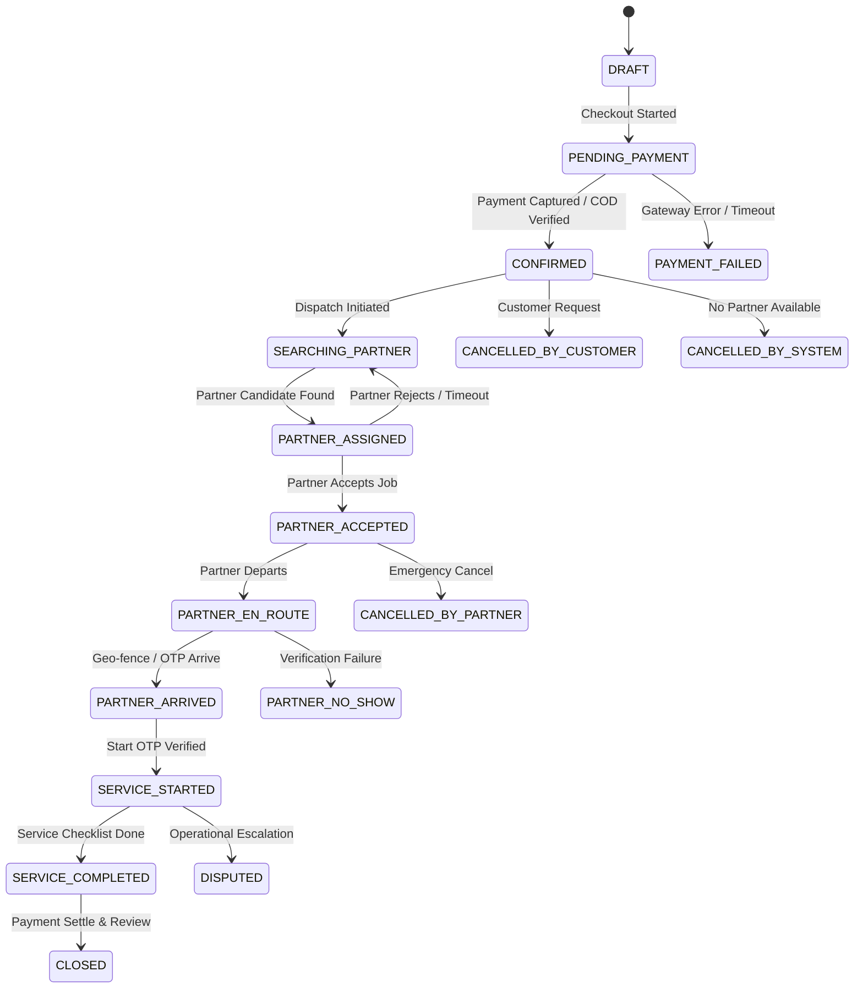

# SERVENTICA — Authoritative Booking Lifecycle & State Machine

## 1. Legal State Transition Graph

## 2. Transition Guard Matrix

| From Status | Allowed Target Statuses | Initiator Roles | Preconditions & Validation |
| :--- | :--- | :--- | :--- |
| `DRAFT` | `PENDING_PAYMENT` | `CUSTOMER` | Serviceable zone, items valid, slot available |
| `PENDING_PAYMENT` | `CONFIRMED`, `PAYMENT_FAILED` | `SYSTEM`, `WEBHOOK` | Razorpay cryptographic signature verified |
| `CONFIRMED` | `SEARCHING_PARTNER`, `CANCELLED_BY_CUSTOMER` | `SYSTEM`, `CUSTOMER` | Cancellation policy fee matrix applied |
| `SEARCHING_PARTNER` | `PARTNER_ASSIGNED`, `CANCELLED_BY_SYSTEM` | `DISPATCH_ENGINE` | Partner verified, active in zone, matching skill |
| `PARTNER_ASSIGNED` | `PARTNER_ACCEPTED`, `SEARCHING_PARTNER` | `PARTNER`, `SYSTEM` | 45s acceptance SLA timeout |
| `PARTNER_ACCEPTED` | `PARTNER_EN_ROUTE`, `CANCELLED_BY_PARTNER` | `PARTNER` | Partner location tracking active |
| `PARTNER_EN_ROUTE` | `PARTNER_ARRIVED` | `PARTNER` | Within 150m of customer address |
| `PARTNER_ARRIVED` | `SERVICE_STARTED` | `PARTNER` | Validated customer Start OTP |
| `SERVICE_STARTED` | `SERVICE_COMPLETED`, `DISPUTED` | `PARTNER`, `CUSTOMER` | Completed service tasks checklist |
| `SERVICE_COMPLETED` | `CLOSED` | `SYSTEM` | Payout calculation recorded to financial ledger |
